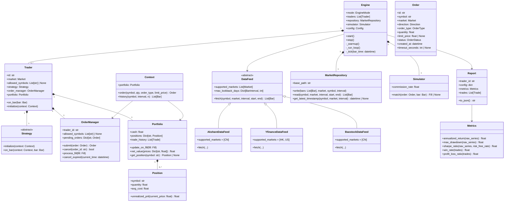
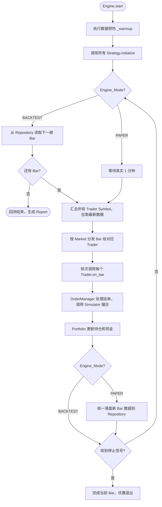
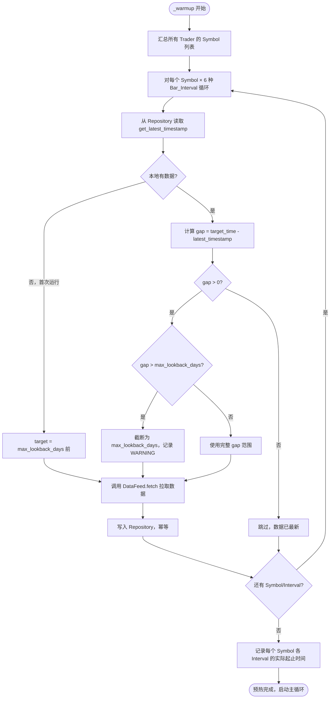

# TradeCraft 自动化交易系统 — 技术设计文档

## 概览

TradeCraft 是一个面向对象设计的量化交易系统，采用事件驱动 + 主循环架构。Engine 作为统一调度核心，以 1 分钟为步长驱动所有 Trader 执行策略。系统支持 BACKTEST（回测）和 PAPER（模拟盘）两种运行模式，共享同一套主循环逻辑，仅在时间推进方式上有所区别。

设计原则：
- 组合优于继承：Trader 通过组合持有 Strategy、OrderManager、Portfolio，而非继承
- 单一职责：每个类只负责一个明确的领域
- 依赖注入：DataFeed、Simulator 等依赖通过构造参数注入，便于测试和替换
- 幂等性：数据写入操作保证幂等，重复执行不产生副作用

---

## 架构

### 系统架构概览

```
┌─────────────────────────────────────────────────────────────┐
│                        Engine                               │
│  mode: BACKTEST | PAPER                                     │
│  ┌──────────────┐  ┌──────────────┐  ┌──────────────────┐  │
│  │   Trader 1   │  │   Trader 2   │  │    Trader N      │  │
│  │ strategy     │  │ strategy     │  │  strategy        │  │
│  │ order_mgr    │  │ order_mgr    │  │  order_mgr       │  │
│  │ portfolio    │  │ portfolio    │  │  portfolio       │  │
│  │ market: CN   │  │ market: US   │  │  market: HK      │  │
│  └──────────────┘  └──────────────┘  └──────────────────┘  │
│                                                             │
│  ┌──────────────────────────────────────────────────────┐   │
│  │              MarketRepository (本地缓存)              │   │
│  └──────────────────────────────────────────────────────┘   │
│  ┌──────────────────────────────────────────────────────┐   │
│  │                   Simulator (撮合)                    │   │
│  └──────────────────────────────────────────────────────┘   │
└─────────────────────────────────────────────────────────────┘
         │                    │
         ▼                    ▼
  DataFeed 子类          配置文件 (YAML)
  Akshare / Yfinance / Baostock
```

### 类关系图



---

## 主循环流程图



---

## 数据预热流程图



---

## 组件与接口

### Engine

Engine 是系统的核心调度器，负责主循环推进、Trader 管理和数据预热。

```python
class EngineMode(Enum):
    BACKTEST = "backtest"
    PAPER = "paper"

class Engine:
    def __init__(
        self,
        mode: EngineMode,
        traders: List[Trader],
        repository: MarketRepository,
        simulator: Simulator,
        data_feeds: List[DataFeed],
        config: Config,
    ): ...

    def start(self) -> None:
        """执行预热 → 初始化所有策略 → 启动主循环"""

    def stop(self) -> None:
        """设置停止标志，等待当前 Bar 完成后退出"""

    def _warmup(self) -> None:
        """汇总 Symbol，补齐所有 Bar_Interval 的本地数据"""

    def _run_loop(self) -> None:
        """主循环：BACKTEST 直接跳 Bar，PAPER 等待真实 1 分钟"""

    def _tick(self, bar_time: datetime) -> None:
        """单个 Bar 的完整处理：分发数据 → 驱动 Trader → 落盘"""

    def _generate_reports(self) -> List[Report]:
        """回测结束时为每个 Trader 生成 Report"""
```

**职责说明：**
- BACKTEST 模式：从 Repository 按时间顺序读取历史 Bar，直接推进，不等待
- PAPER 模式：每分钟通过 DataFeed 拉取最新数据，等待真实时间流逝，仅在交易时段内运行
- 某个 Trader 的 Strategy 抛出异常时，记录日志并跳过该 Trader 当前 Bar，不影响其他 Trader

---

### Trader

Trader 是独立的交易主体，通过组合持有所有交易相关组件。

```python
class Trader:
    def __init__(
        self,
        id: str,
        market: Market,
        strategy: Strategy,
        order_manager: OrderManager,
        portfolio: Portfolio,
        allowed_symbols: List[str] | None = None,
    ): ...

    def initialize(self, context: Context) -> None:
        """调用 strategy.initialize(context)"""

    def on_bar(self, bar: Bar) -> None:
        """构造 Context，调用 strategy.on_bar(context, bar)"""
```

**职责说明：**
- `allowed_symbols=None` 表示该 Market 内所有 Symbol 均可交易
- 下单时由 OrderManager 校验 Symbol 是否在 allowed_symbols 内
- 每个 Trader 的 Portfolio 和 OrderManager 完全独立，互不影响

---

### Market 枚举

```python
class Market(Enum):
    CN = "CN"   # A股，时区 Asia/Shanghai，交易时段 09:30-11:30, 13:00-15:00
    HK = "HK"   # 港股，时区 Asia/Hong_Kong，交易时段 09:30-12:00, 13:00-16:00
    US = "US"   # 美股，时区 America/New_York，交易时段 09:30-16:00

@dataclass
class MarketInfo:
    timezone: str
    sessions: List[Tuple[time, time]]  # [(开盘, 收盘), ...]

MARKET_INFO: Dict[Market, MarketInfo] = {
    Market.CN: MarketInfo("Asia/Shanghai", [(time(9,30), time(11,30)), (time(13,0), time(15,0))]),
    Market.HK: MarketInfo("Asia/Hong_Kong", [(time(9,30), time(12,0)), (time(13,0), time(16,0))]),
    Market.US: MarketInfo("America/New_York", [(time(9,30), time(16,0))]),
}
```

---

### Strategy 基类

```python
class Strategy(ABC):
    @abstractmethod
    def initialize(self, context: Context) -> None:
        """策略初始化，设置参数、订阅数据等"""

    @abstractmethod
    def on_bar(self, context: Context, bar: Bar) -> None:
        """每个 Bar 触发，包含交易逻辑"""
```

---

### Context

Context 是策略执行时的沙箱接口，由 Engine 在每个 Bar 构造并传入策略。

```python
class Context:
    def __init__(
        self,
        trader: Trader,
        repository: MarketRepository,
        current_time: datetime,
    ): ...

    @property
    def portfolio(self) -> Portfolio:
        """只读访问当前 Trader 的 Portfolio"""

    def order(
        self,
        symbol: str,
        quantity: float,
        order_type: OrderType = OrderType.MARKET,
        limit_price: float | None = None,
    ) -> Order:
        """提交订单到 OrderManager"""

    def history(
        self,
        symbol: str,
        interval: BarInterval,
        n: int,
    ) -> List[Bar]:
        """查询历史 Bar，只返回 current_time 之前的数据，防止前视偏差"""
```

---

### OrderManager

```python
class OrderStatus(Enum):
    PENDING    = "pending"      # 待提交
    SUBMITTED  = "submitted"    # 已提交
    PARTIAL    = "partial"      # 部分成交
    FILLED     = "filled"       # 全部成交
    CANCELLED  = "cancelled"    # 已撤销

class OrderType(Enum):
    MARKET = "market"
    LIMIT  = "limit"

class Direction(Enum):
    BUY  = "buy"
    SELL = "sell"

class OrderManager:
    def __init__(
        self,
        trader_id: str,
        allowed_symbols: List[str] | None,
        event_bus: EventBus,
    ): ...

    def submit(self, order: Order) -> Order:
        """校验 Symbol 权限，分配唯一 ID，状态设为 SUBMITTED"""

    def cancel(self, order_id: str) -> bool:
        """手动撤销未完全成交的订单"""

    def process_fill(self, fill: Fill) -> None:
        """更新订单状态，发布状态变更事件"""

    def cancel_expired(self, current_time: datetime) -> List[Order]:
        """撤销所有超时未成交的订单"""

    def get_open_orders(self) -> List[Order]:
        """返回所有未完成订单"""
```

**状态流转：**
```
PENDING → SUBMITTED → PARTIAL → FILLED
                    ↘          ↗
                     CANCELLED
```

---

### Portfolio / Position

```python
@dataclass
class Position:
    symbol: str
    quantity: float
    avg_cost: float

    def unrealized_pnl(self, current_price: float) -> float:
        return (current_price - self.avg_cost) * self.quantity

@dataclass
class Trade:
    timestamp: datetime
    symbol: str
    direction: Direction
    quantity: float
    price: float
    commission: float

class Portfolio:
    def __init__(self, initial_cash: float): ...

    @property
    def cash(self) -> float: ...

    @property
    def positions(self) -> Dict[str, Position]: ...

    @property
    def trade_history(self) -> List[Trade]: ...

    def net_value(self, prices: Dict[str, float]) -> float:
        """现金 + 所有持仓市值"""

    def update_on_fill(self, fill: Fill) -> None:
        """成交后更新持仓和现金，持仓归零时移除 Position"""

    def can_sell(self, symbol: str, quantity: float) -> bool:
        """检查是否有足够持仓"""
```

---

### DataFeed 类层次

```python
class BarInterval(Enum):
    M1  = "1m"
    M5  = "5m"
    M15 = "15m"
    M30 = "30m"
    H1  = "60m"
    D1  = "1d"

@dataclass
class Bar:
    symbol: str
    market: Market
    interval: BarInterval
    timestamp: datetime
    open: float
    high: float
    low: float
    close: float
    volume: float

class DataFeed(ABC):
    supported_markets: ClassVar[List[Market]]
    max_lookback_days: ClassVar[Dict[BarInterval, int]]

    @abstractmethod
    def fetch(
        self,
        symbol: str,
        market: Market,
        interval: BarInterval,
        start: datetime,
        end: datetime,
    ) -> List[Bar]:
        """拉取指定范围的 K 线数据，失败时抛出异常"""

class AkshareDataFeed(DataFeed):
    supported_markets = [Market.CN]
    max_lookback_days = {
        BarInterval.M1: 5, BarInterval.M5: 60, BarInterval.M15: 60,
        BarInterval.M30: 60, BarInterval.H1: 365, BarInterval.D1: 3650,
    }

class YfinanceDataFeed(DataFeed):
    supported_markets = [Market.HK, Market.US]
    max_lookback_days = {
        BarInterval.M1: 7, BarInterval.M5: 60, BarInterval.M15: 60,
        BarInterval.M30: 60, BarInterval.H1: 730, BarInterval.D1: 3650,
    }

class BaostockDataFeed(DataFeed):
    supported_markets = [Market.CN]
    max_lookback_days = {
        BarInterval.M1: 5, BarInterval.M5: 60, BarInterval.M15: 60,
        BarInterval.M30: 60, BarInterval.H1: 365, BarInterval.D1: 3650,
    }
```

**DataFeed 选择策略：** Engine 根据 Trader 的 Market 自动选择对应的 DataFeed 实现。若同一 Market 有多个 DataFeed（如 CN 有 Akshare 和 Baostock），通过配置文件指定优先级。

---

### MarketRepository

```python
class MarketRepository:
    def __init__(self, base_path: str = "data/market"): ...

    def write(
        self,
        bars: List[Bar],
        market: Market,
        symbol: str,
        interval: BarInterval,
    ) -> int:
        """幂等写入，返回实际新增条数"""

    def read(
        self,
        symbol: str,
        market: Market,
        interval: BarInterval,
        start: datetime,
        end: datetime,
    ) -> List[Bar]:
        """按条件查询，结果按时间戳升序排列"""

    def get_latest_timestamp(
        self,
        symbol: str,
        market: Market,
        interval: BarInterval,
    ) -> datetime | None:
        """返回本地最新数据时间戳，无数据时返回 None"""
```

---

### Simulator（撮合引擎）

```python
@dataclass
class Fill:
    order_id: str
    symbol: str
    market: Market
    direction: Direction
    quantity: float
    price: float
    commission: float
    timestamp: datetime

class Simulator:
    def __init__(self, commission_rate: float = 0.0003): ...

    def match(self, order: Order, bar: Bar) -> Fill | None:
        """
        撮合规则：
        - 市价单：以 bar.close 成交
        - 限价买单：bar.high >= limit_price → 以 limit_price 成交
        - 限价卖单：bar.low <= limit_price → 以 limit_price 成交
        - 不考虑流动性，价格触及即全部成交
        """
```

---

### Metrics / Report

```python
class Metrics:
    @staticmethod
    def annualized_return(nav_series: List[float], trading_days: int = 252) -> float:
        """年化收益率"""

    @staticmethod
    def max_drawdown(nav_series: List[float]) -> float:
        """最大回撤（负值）"""

    @staticmethod
    def sharpe_ratio(
        nav_series: List[float],
        risk_free_rate: float = 0.02,
        trading_days: int = 252,
    ) -> float:
        """夏普比率，交易次数为零时返回 0.0"""

    @staticmethod
    def win_rate(trades: List[Trade]) -> float:
        """胜率，无交易时返回 0.0"""

    @staticmethod
    def profit_loss_ratio(trades: List[Trade]) -> float:
        """盈亏比，无交易时返回 0.0"""

@dataclass
class Report:
    trader_id: str
    strategy_params: dict
    backtest_start: datetime
    backtest_end: datetime
    initial_cash: float
    final_nav: float
    metrics: dict          # Metrics 各指标的计算结果
    trades: List[Trade]    # 完整逐笔成交记录

    def to_json(self) -> str:
        """导出为 JSON 字符串"""

    @classmethod
    def from_json(cls, json_str: str) -> "Report":
        """从 JSON 字符串反序列化"""
```

---

### StrategyLoader

```python
@dataclass
class LoadResult:
    success: bool
    strategy: Strategy | None
    error: str | None

class StrategyLoader:
    @staticmethod
    def load(file_path: str, params: dict = {}) -> LoadResult:
        """动态导入策略文件，实例化 Strategy 子类"""

    @staticmethod
    def scan(directory: str) -> List[str]:
        """扫描目录，返回所有 .py 策略文件路径"""
```

---

### 事件总线

```python
class EventType(Enum):
    ORDER_STATUS_CHANGED = "order_status_changed"
    FILL_EXECUTED        = "fill_executed"
    BAR_COMPLETED        = "bar_completed"
    ENGINE_STOPPED       = "engine_stopped"

class EventBus:
    def subscribe(self, event_type: EventType, handler: Callable) -> None: ...
    def publish(self, event_type: EventType, payload: Any) -> None: ...
```

---

## 数据模型

### Bar（K 线数据）

| 字段 | 类型 | 说明 |
|------|------|------|
| symbol | str | 标的代码 |
| market | Market | 所属市场 |
| interval | BarInterval | K 线周期 |
| timestamp | datetime | Bar 开始时间（UTC） |
| open | float | 开盘价 |
| high | float | 最高价 |
| low | float | 最低价 |
| close | float | 收盘价 |
| volume | float | 成交量 |

### Order（订单）

| 字段 | 类型 | 说明 |
|------|------|------|
| id | str | 唯一订单 ID（UUID） |
| symbol | str | 标的代码 |
| market | Market | 所属市场 |
| direction | Direction | BUY / SELL |
| order_type | OrderType | MARKET / LIMIT |
| quantity | float | 委托数量 |
| limit_price | float \| None | 限价单挂单价 |
| status | OrderStatus | 当前状态 |
| created_at | datetime | 创建时间 |
| timeout_seconds | int \| None | 超时自动撤销秒数 |

### Trade（成交记录）

| 字段 | 类型 | 说明 |
|------|------|------|
| timestamp | datetime | 成交时间 |
| symbol | str | 标的代码 |
| direction | Direction | 买入 / 卖出 |
| quantity | float | 成交数量 |
| price | float | 成交价格 |
| commission | float | 手续费 |

---

## 数据存储结构

### 本地市场数据缓存

```
data/
├── market/
│   ├── CN/
│   │   ├── 000001.SZ/
│   │   │   ├── 1m/
│   │   │   │   └── 2024-01.parquet   # 按月分片
│   │   │   ├── 5m/
│   │   │   ├── 15m/
│   │   │   ├── 30m/
│   │   │   ├── 60m/
│   │   │   └── 1d/
│   │   └── 600519.SH/
│   ├── HK/
│   │   └── 0700.HK/
│   └── US/
│       └── AAPL/
├── runs/
│   └── {run_id}/
│       ├── {trader_id}_trades.json
│       └── {trader_id}_report.json
├── logs/
│   └── {date}.log
└── cache/
    └── portfolio_{trader_id}.json   # Paper 模式持久化
```

**存储格式：** Parquet（高效列式存储，支持按时间范围快速查询）

**幂等写入实现：** 写入前先读取已有数据的时间戳集合，过滤掉重复时间戳后再追加写入。

---

## 配置文件示例（YAML）

```yaml
# config.yaml
mode: backtest  # backtest | paper

bar_interval: 1m

backtest:
  start_date: "2023-01-01"
  end_date: "2023-12-31"

data_sources:
  CN: akshare      # akshare | baostock
  HK: yfinance
  US: yfinance

traders:
  - id: trader_cn_momentum
    market: CN
    initial_cash: 1000000.0
    allowed_symbols:
      - "000001.SZ"
      - "600519.SH"
      - "300750.SZ"
    strategy_path: "strategies/momentum.py"
    strategy_params:
      fast_period: 5
      slow_period: 20
    order_timeout_seconds: 300
    commission_rate: 0.0003

  - id: trader_us_trend
    market: US
    initial_cash: 100000.0
    allowed_symbols: null   # null 表示该 Market 内无限制
    strategy_path: "strategies/trend_following.py"
    strategy_params:
      lookback: 50
    order_timeout_seconds: 600
    commission_rate: 0.001

logging:
  level: INFO   # DEBUG | INFO | WARNING | ERROR
  file: "data/logs/tradecraft.log"
```

**环境变量覆盖示例：**
```bash
TRADECRAFT_MODE=paper
TRADECRAFT_TRADERS_0_INITIAL_CASH=500000
```

**优先级：** 环境变量 > 用户配置文件 > 默认配置

---

## 错误处理

| 场景 | 处理方式 |
|------|----------|
| Strategy.on_bar 抛出异常 | 记录 ERROR 日志，跳过该 Trader 当前 Bar，继续执行其他 Trader |
| DataFeed.fetch 失败 | 抛出包含数据源名称和原因的异常，预热失败时记录 WARNING 并跳过该 Symbol/Interval |
| 持久化写入失败 | 记录 ERROR 日志，继续运行主循环，不中断交易 |
| 配置文件缺少必填字段 | 启动时报告所有缺失字段，拒绝启动 |
| 卖出超过持仓数量 | OrderManager 拒绝订单，返回错误信息，记录 WARNING |
| 对不在 allowed_symbols 内的 Symbol 下单 | OrderManager 拒绝订单，记录原因 |
| 未捕获的 Engine 级异常 | 记录 ERROR 日志，安全停止，持久化已成交记录 |
| 数据缺口超过 max_lookback_days | 截断拉取范围，记录 WARNING 说明数据不完整 |

---

## 正确性属性

*属性（Property）是在系统所有有效执行中都应成立的特征或行为——本质上是对系统应该做什么的形式化陈述。属性是人类可读规范与机器可验证正确性保证之间的桥梁。*

### 属性 1：主循环步长一致性

*对于任意* 回测 Bar 序列，Engine 推送给 Trader 的相邻两个 Bar 的时间戳差值应等于配置的 bar_interval（1 分钟）。

**验证需求：1.1**

---

### 属性 2：多 Trader 均被驱动

*对于任意* 数量的 Trader 列表，Engine 在每个 Bar 内应恰好调用每个 Trader 的 on_bar 一次。

**验证需求：1.5, 2.4**

---

### 属性 3：Trader 隔离性

*对于任意* 两个 Trader，对其中一个 Trader 执行下单和成交操作，另一个 Trader 的 Portfolio（持仓、现金）应保持不变。

**验证需求：2.4**

---

### 属性 4：allowed_symbols 权限校验

*对于任意* 指定了 allowed_symbols 列表的 Trader，当策略尝试对不在列表内的 Symbol 下单时，OrderManager 应拒绝该订单，且 Portfolio 状态不变。

**验证需求：2.2, 2.3**

---

### 属性 5：Market 数据路由

*对于任意* 混合了多个 Market 的 Bar 数据集，Engine 应只将属于某 Trader 所属 Market 的 Bar 推送给该 Trader，不推送其他 Market 的 Bar。

**验证需求：2.5**

---

### 属性 6：初始资金注入

*对于任意* 初始资金配置值，Trader 初始化后其 Portfolio 的现金余额应等于该配置值，且持仓列表为空。

**验证需求：2.6**

---

### 属性 7：单个 Trader 异常不影响其他 Trader

*对于任意* 包含一个会抛出异常的 Strategy 的 Trader 列表，其他 Trader 的 on_bar 应仍被正常调用，且其 Portfolio 状态正确更新。

**验证需求：2.7**

---

### 属性 8：历史 Bar 查询无前视偏差

*对于任意* 当前 Bar 时间戳 T，通过 context.history() 查询到的所有 Bar 的时间戳均应严格小于 T。

**验证需求：9.6**

---

### 属性 9：策略文件加载失败返回失败结果

*对于任意* 不存在的文件路径或含语法错误的 Python 文件，StrategyLoader.load() 应返回 success=False 的 LoadResult，而不是抛出未处理异常。

**验证需求：4.2**

---

### 属性 10：幂等写入

*对于任意* Bar 数据集，将其写入 MarketRepository 两次后，查询结果应与写入一次相同，不产生重复记录。

**验证需求：6.8**

---

### 属性 11：Market 数据隔离存储

*对于任意* 两个不同 Market 下的同名 Symbol，分别写入数据后，查询其中一个 Market 的数据不应包含另一个 Market 的记录。

**验证需求：5.5**

---

### 属性 12：Simulator 撮合规则

*对于任意* 订单和 Bar 数据：
- 市价单应以 bar.close 成交
- 限价买单：当 bar.high >= limit_price 时以 limit_price 成交，否则不成交
- 限价卖单：当 bar.low <= limit_price 时以 limit_price 成交，否则不成交

**验证需求：9.3**

---

### 属性 13：手续费计算正确性

*对于任意* 成交金额和手续费率，Simulator 计算的手续费应等于成交金额 × 手续费率。

**验证需求：9.4**

---

### 属性 14：Portfolio 净值计算

*对于任意* 持仓列表和对应的当前价格字典，Portfolio.net_value() 应等于现金余额加上所有持仓数量乘以对应价格之和。

**验证需求：7.3**

---

### 属性 15：成交后 Portfolio 状态更新

*对于任意* 成交事件（Fill），Portfolio 更新后的现金余额和持仓数量应与成交前的状态加上该成交的影响完全一致。

**验证需求：7.1, 7.2**

---

### 属性 16：卖出超量被拒绝

*对于任意* Symbol 的当前持仓数量 Q，尝试卖出数量 > Q 的订单应被 Portfolio 拒绝，且持仓状态不变。

**验证需求：7.5**

---

### 属性 17：成交历史完整性

*对于任意* 成交序列，Portfolio.trade_history 中的记录数量应等于成交事件的总数，且每条记录包含时间、Symbol、方向、数量、价格和手续费。

**验证需求：7.6**

---

### 属性 18：订单 ID 唯一性

*对于任意* 数量的订单提交操作，OrderManager 分配的所有订单 ID 应两两不同。

**验证需求：8.1**

---

### 属性 19：订单状态合法流转

*对于任意* 订单，其状态只能按照 PENDING → SUBMITTED → PARTIAL → FILLED/CANCELLED 的路径流转，不能跳跃或逆向。

**验证需求：8.2**

---

### 属性 20：回测 Bar 时间戳单调递增

*对于任意* 回测数据集，Engine 推送给 Trader 的 Bar 序列时间戳应严格单调递增。

**验证需求：9.1**

---

### 属性 21：Metrics 计算正确性（含零交易边界情况）

*对于任意* 净值序列和成交记录列表（包括空列表），Metrics 的各项指标计算应返回数值结果，不抛出除零异常；空成交时胜率和盈亏比返回 0.0。

**验证需求：11.1, 11.2, 11.5**

---

### 属性 22：Report JSON 序列化往返

*对于任意* Report 实例，将其序列化为 JSON 后再反序列化，应得到与原始实例等价的对象（所有字段值相同）。

**验证需求：11.4**

---

### 属性 23：Report 包含完整成交记录

*对于任意* 回测运行，生成的 Report 中的 trades 列表长度应等于该 Trader 的 Portfolio.trade_history 长度。

**验证需求：11.6**

---

### 属性 24：配置加载正确性

*对于任意* 合法的 YAML 配置文件，加载后的 Config 对象中每个字段值应与配置文件中的值一致。

**验证需求：13.1**

---

### 属性 25：缺少必填字段时拒绝启动

*对于任意* 缺少一个或多个必填字段的配置文件，Engine 启动时应报告所有缺失字段并拒绝启动，不进入主循环。

**验证需求：13.3**

---

### 属性 26：多配置优先级合并

*对于任意* 存在冲突的环境变量、用户配置和默认配置，合并后的配置应遵循"环境变量 > 用户配置 > 默认配置"的优先级，高优先级的值覆盖低优先级的值。

**验证需求：13.5**

---

## 测试策略

### 双轨测试方法

系统采用单元测试和基于属性的测试（Property-Based Testing）相结合的方式：

- **单元测试**：验证具体示例、边界情况和错误条件
- **属性测试**：通过随机生成大量输入验证普遍性规则

两者互补，共同保证系统正确性。

### 属性测试配置

- 使用 [Hypothesis](https://hypothesis.readthedocs.io/) 作为 Python 属性测试库
- 每个属性测试最少运行 100 次迭代（`@settings(max_examples=100)`）
- 每个属性测试必须通过注释引用设计文档中对应的属性编号

**标签格式：**
```python
# Feature: automated-trading-system, Property N: <属性描述>
```

**示例：**
```python
from hypothesis import given, settings, strategies as st

# Feature: automated-trading-system, Property 10: 幂等写入
@given(bars=st.lists(bar_strategy(), min_size=1))
@settings(max_examples=100)
def test_idempotent_write(bars, tmp_repository):
    tmp_repository.write(bars, Market.CN, "000001.SZ", BarInterval.M1)
    tmp_repository.write(bars, Market.CN, "000001.SZ", BarInterval.M1)
    result = tmp_repository.read("000001.SZ", Market.CN, BarInterval.M1, ...)
    assert len(result) == len(set(b.timestamp for b in bars))
```

### 单元测试重点

- 各 DataFeed 子类的 fetch() 接口（使用 mock 避免真实网络请求）
- Engine 启动/停止流程
- 配置文件解析和环境变量覆盖
- StrategyLoader 的错误处理路径
- Market 交易时段判断逻辑
- 数据预热的缺口计算逻辑

### 属性测试重点

每个正确性属性（属性 1-26）对应一个属性测试，使用 Hypothesis 生成随机输入验证。重点属性：

- 属性 10（幂等写入）：生成随机 Bar 列表，验证重复写入不产生重复记录
- 属性 12（Simulator 撮合规则）：生成随机 Bar 和订单，验证成交价格符合规则
- 属性 19（订单状态合法流转）：生成随机操作序列，验证状态机不进入非法状态
- 属性 22（Report JSON 往返）：生成随机 Report，验证序列化/反序列化等价性
