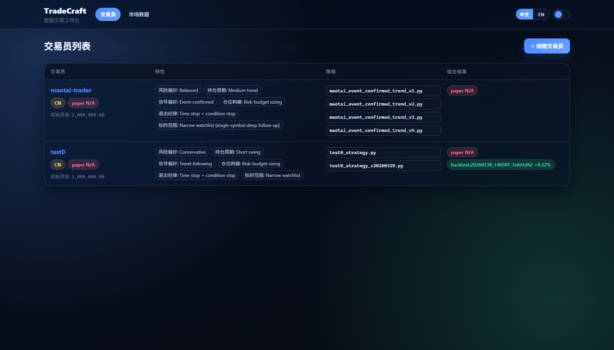
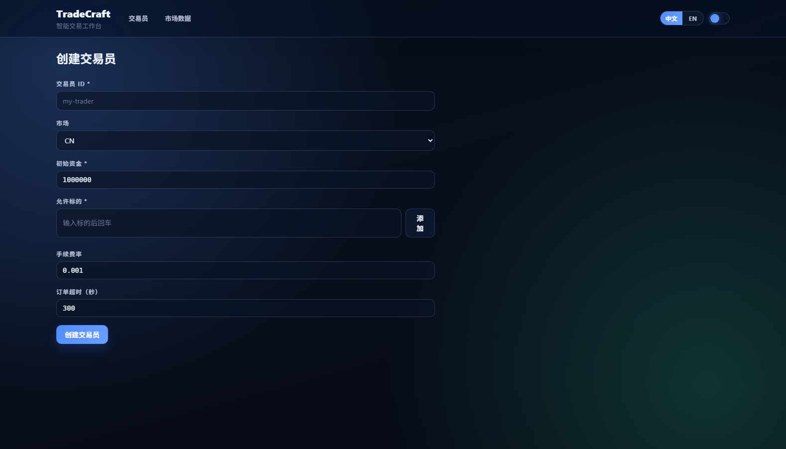
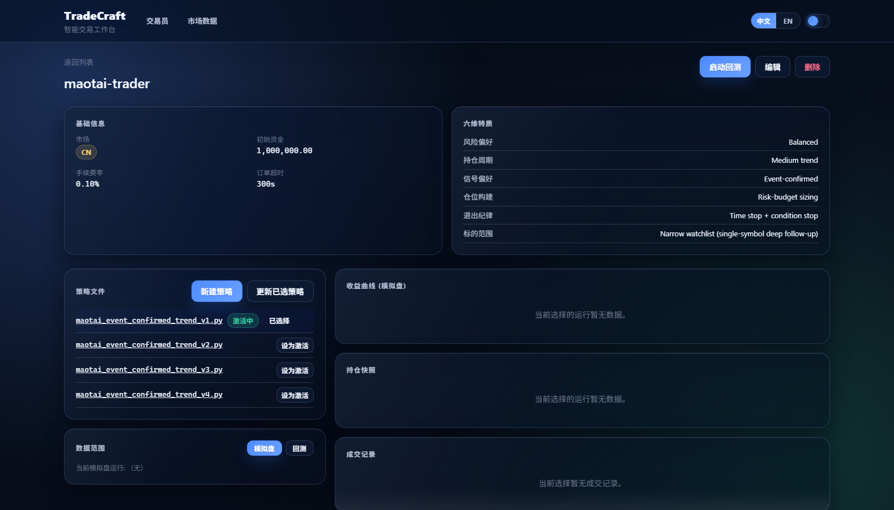
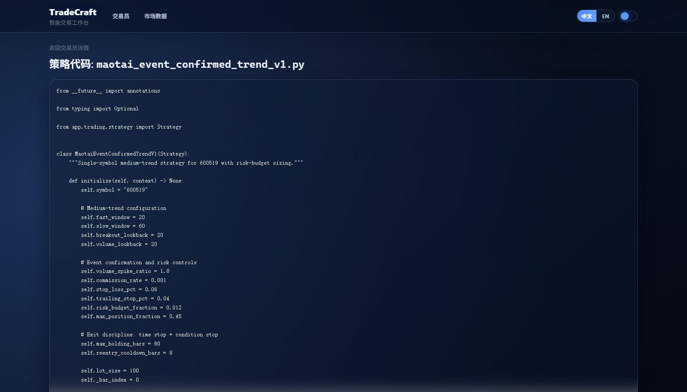
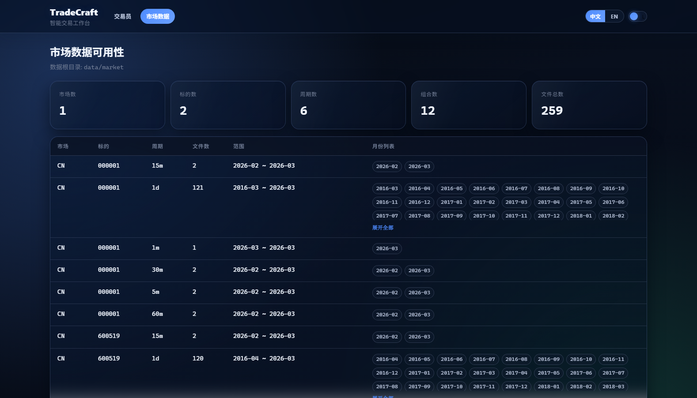
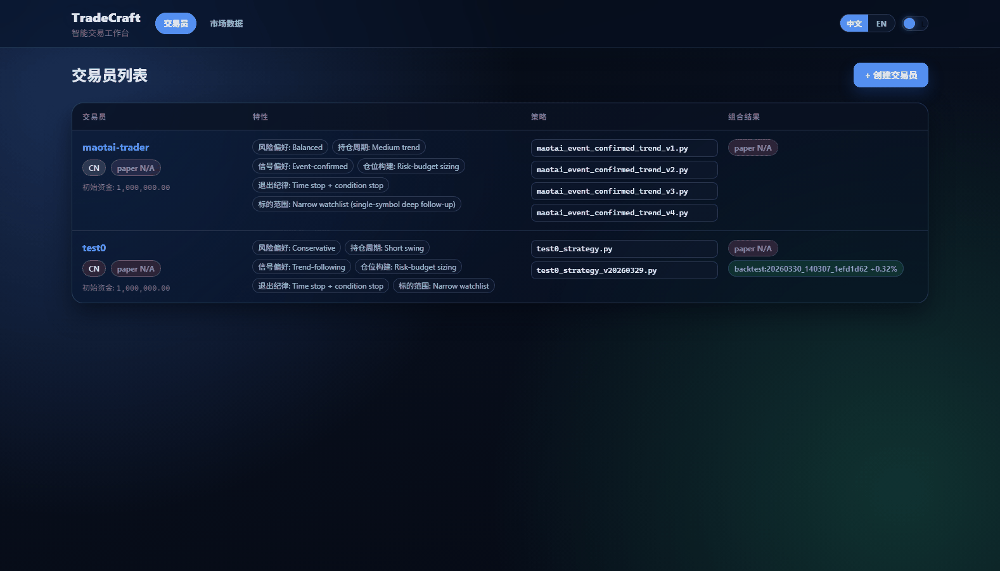

# TradeCraft

Language: English | [简体中文](./README_zh.md)

Written by AI, powered by AI, researched by AI, with AI-implemented strategies.

Still limited by the lack of higher-frequency data for AI research~~~

## UI Preview

> Screenshots in this section are from the local development environment `http://localhost:5173` (2026-03-31).

### Feature Screenshots (Desktop)

#### Trader List


#### Create Trader


#### Trader Detail


#### Strategy Source Page


#### Market Data Page


### Demo GIF




## Project Structure

```text
TradeCraft/
|-- backend/
|   |-- app/
|   |   |-- adapters/
|   |   |-- api/
|   |   |-- backtest/
|   |   |-- core/
|   |   |-- data/
|   |   |-- engine/
|   |   |-- models/
|   |   |-- runtimes/
|   |   `-- trading/
|   `-- tests/
|-- packages/
|   |-- shared/
|   |   `-- src/
|   |       |-- types/
|   |       `-- utils/
|   `-- web/
|       |-- dist/
|       `-- src/
|           |-- components/
|           |-- hooks/
|           |-- pages/
|           |-- services/
|           `-- styles/
|-- skills/
|   `-- retail-quant-trainer/
|       |-- agents/
|       `-- references/
`-- .kiro/
```

## Runtime Data Directory (Important)

> The following directories are typically generated after runtime and are located under `data/` at the project root by default.

```text
data/
|-- market/
|   `-- {market}/{symbol}/{interval}/{period}.parquet
`-- traders/
    `-- {trader_id}/
        |-- trader.json
        |-- strategy/
        |   `-- *.py
        |-- trades/
        |   |-- paper/{run_id}/trades.json
        |   `-- backtest/{run_id}/
        |       |-- trades.json
        |       `-- report.json
        `-- portfolio/
            |-- paper.json
            `-- {backtest_run_id}.json
```

## System Feature Overview

### Trader Management

- Create traders: supports market selection (CN/HK/US), initial capital, tradable symbols, fee rate, and order timeout.
- Trader creation supports SSE streaming feedback: the frontend can view training/generation logs and errors in real time.
- Automatically generates six-dimensional trading traits: risk preference, holding period, signal preference, position construction, take-profit/stop-loss discipline, and symbol preference.
- Query trader list and details: view base parameters, traits, strategies, and portfolio performance.
- Edit traders: supports updating capital, symbol pool, fees, timeout parameters, and trait fields.
- Delete traders: removes traders and their directory data.

### Strategy Management and Research

- Strategy file management: list strategy files and set the active strategy.
- Strategy source viewing: supports opening the strategy source page in a new window from the trader detail page.
- Strategy research (Create/Update): uses Codex for streamed research execution, supporting creating a new strategy or updating a specified strategy.
- Strategy research log visualization: the frontend displays streamed messages by info/warning/error/result categories.

### Backtesting and Portfolio Analysis

- One-click backtest run: supports configuring start/end dates and backtest strategy files.
- Supports backtests even when no active strategy is set (strategy file can be explicitly specified).
- Backtest run management: list `run_id` and view trades and portfolio snapshots by `run_id`.
- Backtest reports: provides annualized return, max drawdown, Sharpe ratio, win rate, profit/loss ratio, final net value, and other metrics.
- Backtest filtering: filter backtest runs by strategy file.
- Delete backtest runs: remove trade records, reports, and portfolio snapshot files for a run.
- Paginated trade record view: view records by mode (`paper`/`backtest`) and run.

### Market Data Browsing

- Market data availability overview: statistics for number of markets, symbols, intervals, combinations, and total files.
- Local parquet structure scan: aggregated display by `{market}/{symbol}/{interval}/{period}`.
- File-level detail browsing: paginated parquet row reads with field column display.
- Supports direct navigation from overview to the detail page of a specified period file.

### Runtime Data and Persistence

- Trader data directory-based storage: each trader stores config, strategies, trade records, and portfolio snapshots independently.
- Backtest records are structured by `run_id`: `trades/backtest/{run_id}/trades.json` and `report.json`.
- Portfolio snapshots support separate storage for paper and backtest; backtest supports single-file storage by `run_id`.
- Compatible with historical data layouts: read/delete logic includes fallback handling for old formats.

### Frontend Experience and Usability

- Chinese/English UI switching (`zh`/`en`) with persisted language preference.
- Dark/light theme switching (`dark`/`light`) with persisted theme preference.
- Unified display for error prompts, loading states, and empty states.
- Trader list supports sorting by paper returns and showing recent backtest portfolio return summaries.

### Backend and Open Interfaces

- FastAPI service with automatic OpenAPI docs: `/docs` and `/redoc`.
- Trader APIs: create, query, update, delete, strategy management, portfolio query, trade query, backtest execution, and deletion.
- Market data APIs: availability query and paginated file-detail query.
- CORS support: local frontend development origin (5173) is allowed by default.
